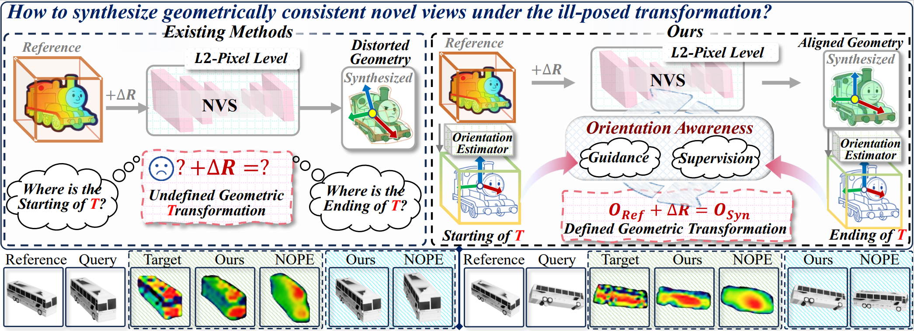

# OrienPose
3D pose estimation
# [OrienPose: Orientation-Guided Novel View Synthesis for Single-Image Unseen Object Pose Estimation(CVPR 2026)]

[](https://arxiv.org/abs/xxxx.xxxxx)
[](https://your-project-page.github.io/)
[](https://opensource.org/licenses/MIT)

<div align="center">
  
</div>

---

## 🛠️ 安装 (Installation)
首先克隆仓库并安装依赖环境：
First, clone the repository and install the required environment:
```bash
git clone [https://github.com/pubyLu/OrienPose.git](https://github.com/pubyLu/OrienPose.git)
cd OrienPose
pip install -r requirements.txt
```
## 📊 数据准备 (Data Preparation)

prepare your dataset, such as shapenet. One test sample must have : 1 reference image + absolute pose, 1 query image, template poses.

## 🚀 测试与推理 (Testing & Inference)
你可以使用预训练模型快速运行推理测试。

You can use the pre-trained model to quickly run inference tests.

1. 下载预训练权重：将权重文件放入 /project_root/weight/ 文件夹。

Download pre-trained weights: Place the weight file in the /project_root/weight/ folder.

2. 运行推理脚本：python test_demo.py

Run the inference script: python test_demo.py

## 📝 引用 (Citation)
